# masterpidgey-examen
## Parte 1
## Comandos
- git clone https://github.com/maaarcmorla/masterpidgey-examen.git
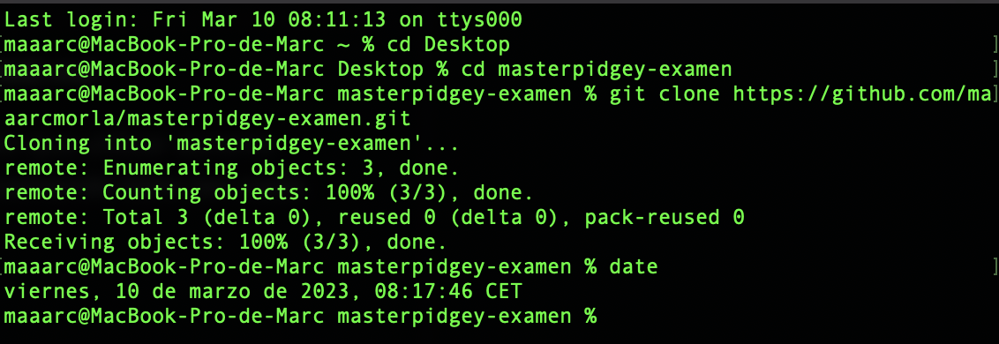

- git add README.md
- git status
- git commit -m "commit inicial"
- git push
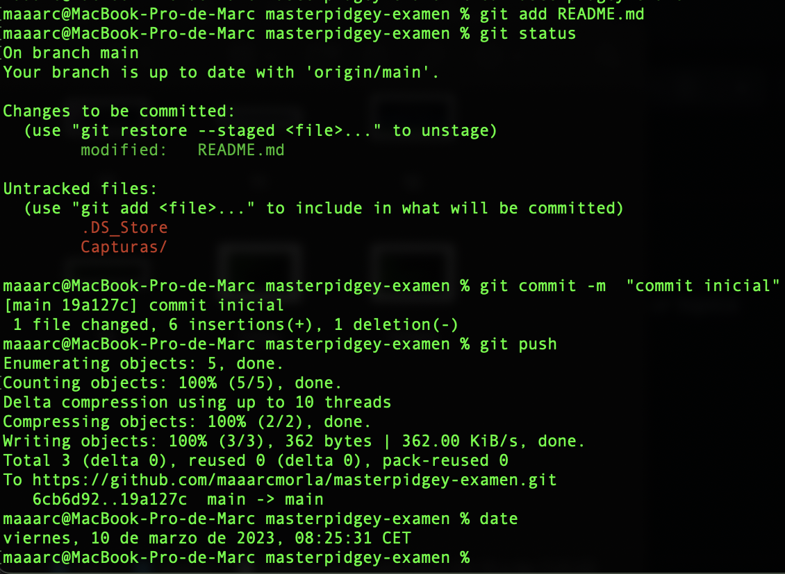
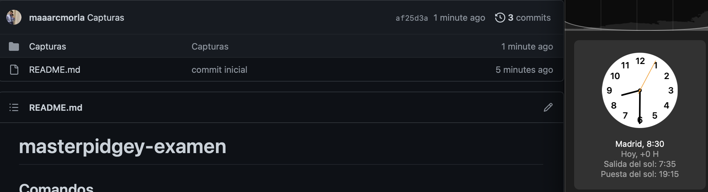

- touch privado.txt
- mkdir privada
- touch .gitignore
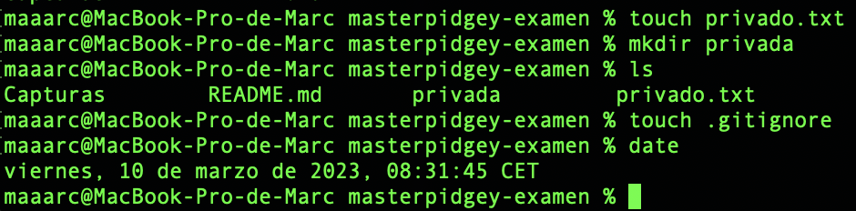
- nano .gitignore
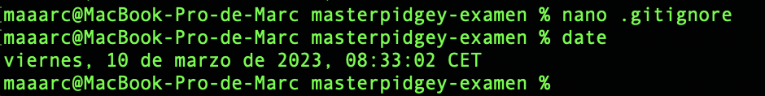
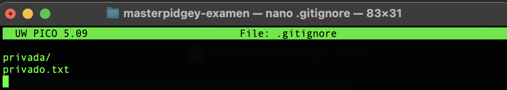
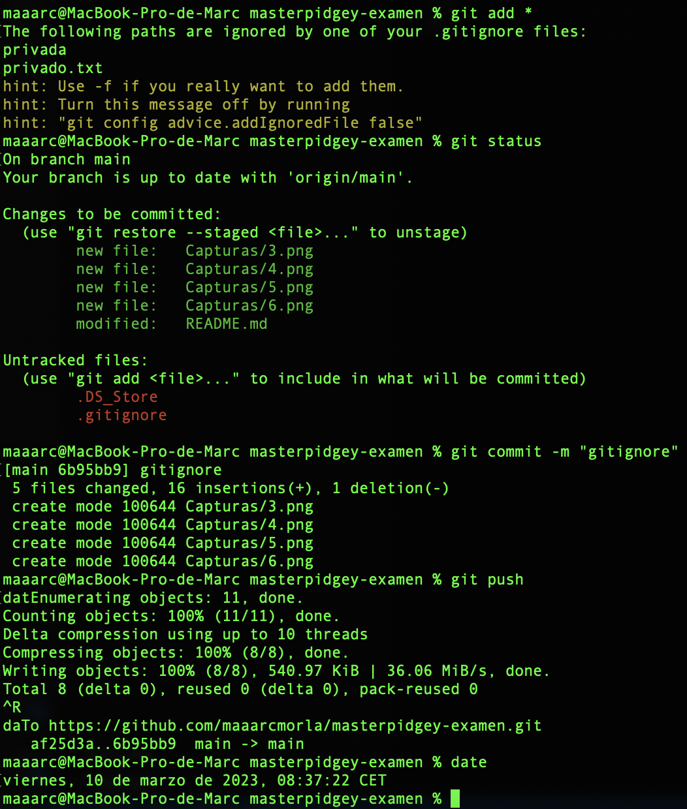

- touch 1.txt
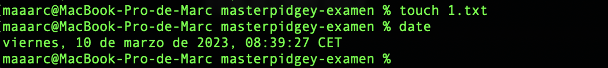

- git tag v0.1
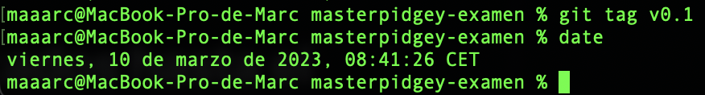

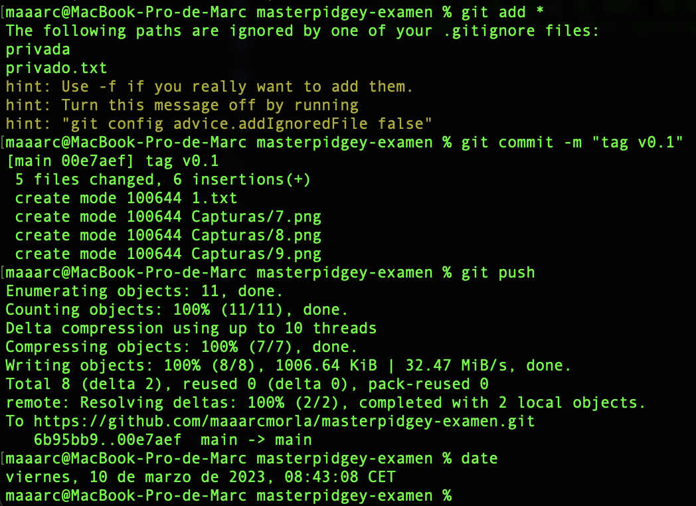

Historial de commits hasta el momento

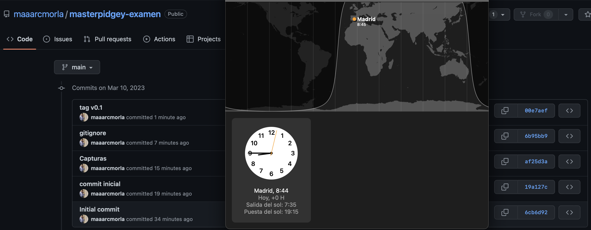

## Parte 2

| NOMBRE | GITHUB |
| -- | -- |
| Máximo Fernández Riera | [enlace a github 1](https://github.com/maximofernandezriera) |

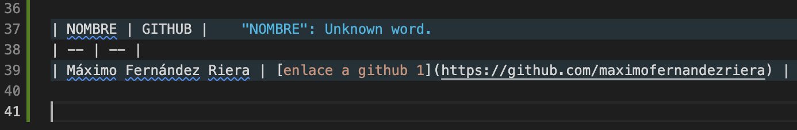
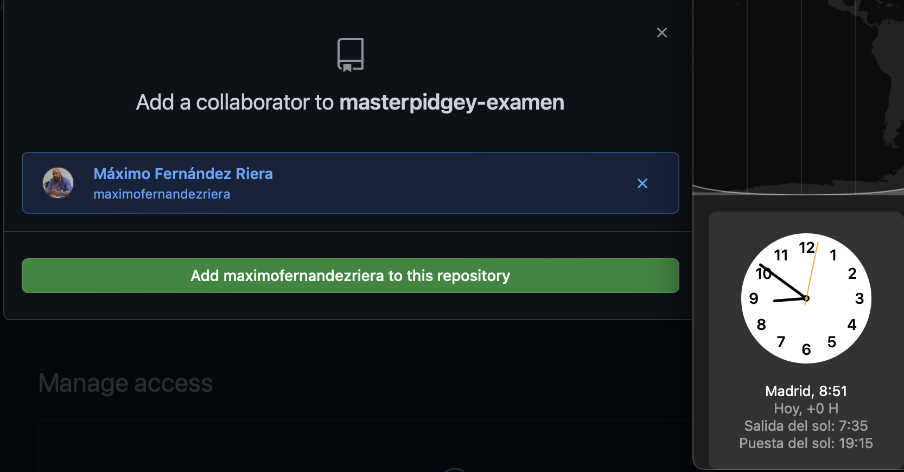
