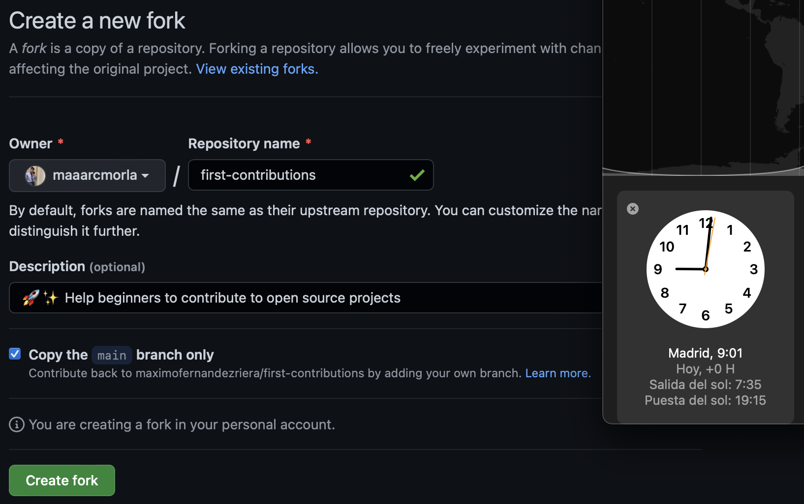
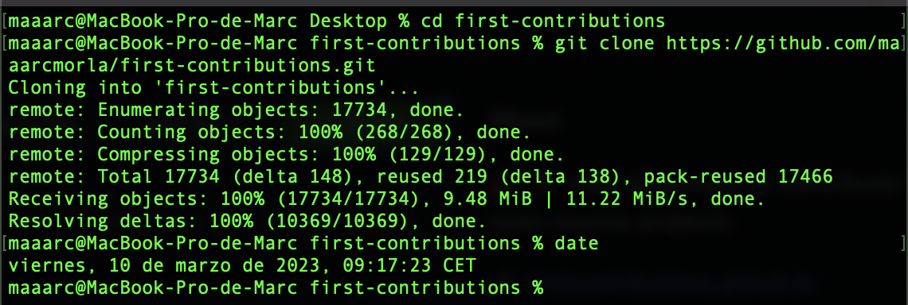
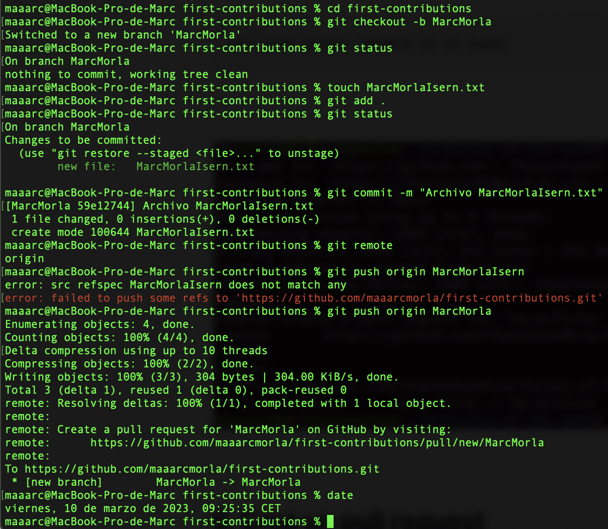
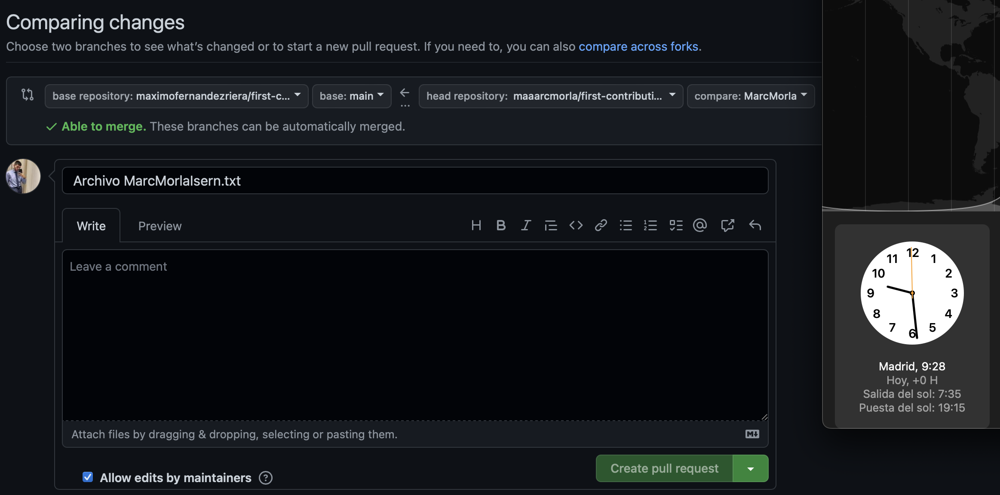
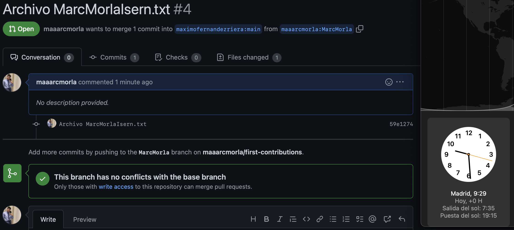

# masterpidgey-examen
## Parte 1
## Comandos
Clonamos el repositorio creado en una carpeta local con el comando:
- git clone https://github.com/maaarcmorla/masterpidgey-examen.git

Creamos el archivo README.md con los siguientes comandos y hacemos un commit inicial.
- git add README.md
- git status
- git commit -m "commit inicial"
- git push

Creamos con comandos el archivo "privado.txt", la carpeta "privada" y el .gitignore para que github ignore tanto privado.txt como el directorio privada.
- touch privado.txt
- mkdir privada
- touch .gitignore

- nano .gitignore

Creamos el archivo "1.txt" con el siguietne comando:
- touch 1.txt

Creamos el tag v0.1 y posteriormente subimos los cambios al repositorio.
- git tag v0.1

Historial de commits hasta el momento

Creamos una tabla con el nombre de Máximo Fernández Riera y su enlace a github.
| NOMBRE | GITHUB |
| -- | -- |
| Máximo Fernández Riera | [enlace a github 1](https://github.com/maximofernandezriera) |

Añadimos a Máximo como colaborador del repositorio.

## Parte 2

En primer lugar creamos un fork para hacer una copia del repositorio first-contributions y lo clonamos en un directorio local

- git clone https://github.com/maaarcmorla/first-contributions.git

Creamos una rama nueva y posrteriormente un archivo .txt y subimos los cambios.
- git checkout -b MarcMorla
- touch MarcMorlaIsern.txt
- git commit -m "Archivo MarcMorlaIsern.txt"
- git remote
- git push origin MarcMorla

Volvemos al repositorio y vamos al apartado de Pull Request, le damos y si hemos hecho los pasos bien podremos crear una pull request

Como podemos ver hemos hecho perfectamente la pull request, ahora solo faltaria que nos acepten los cambios.

